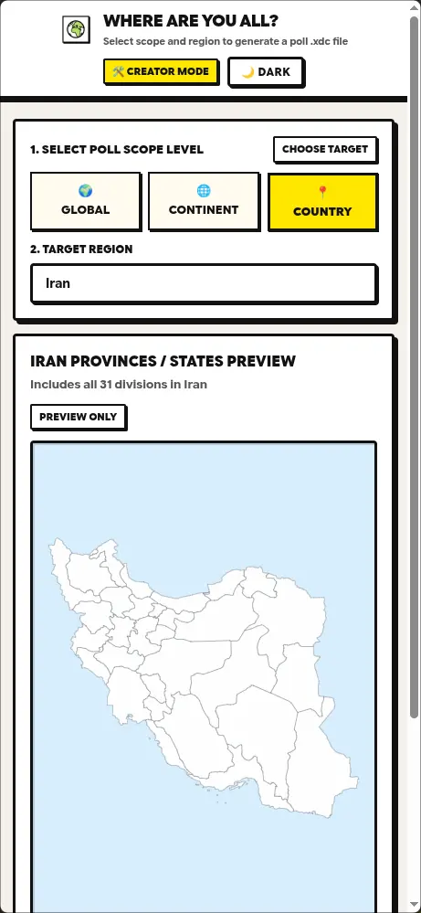
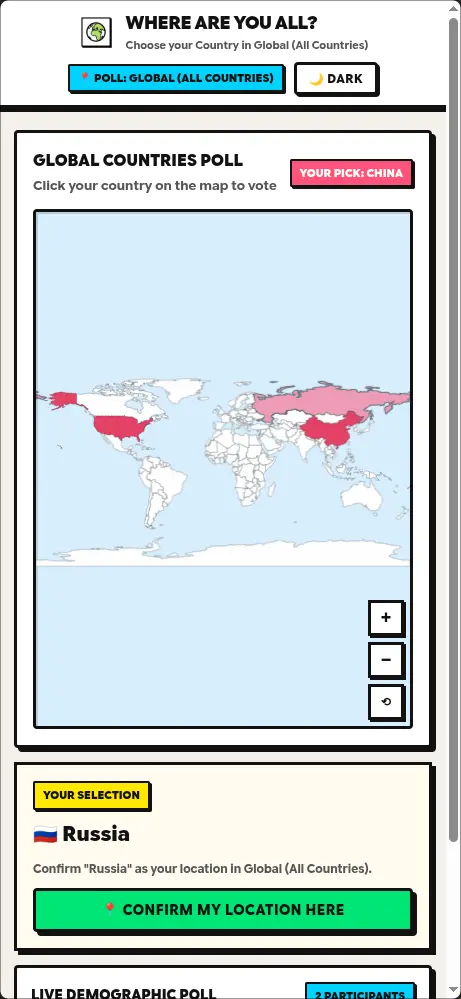

  

<h1 align="center">Where Are You All?</h1>

**Where Are You All?** is a [webxdc](https://webxdc.org) app that runs inside **Delta Chat**, letting you create and share interactive demographic polls with your chat members:

- 🌍 **Three scope levels** — Create polls for Global (all continents), Global (all countries), a specific continent's countries, or a country's states/provinces
- 🗺️ **Interactive SVG maps** — Clickable vector maps for every continent and country, with smooth zoom and pan
- 🔥 **Heat-map coloring** — Dynamic rank-based color intensity shows where participants are concentrated
- 📦 **Package & send** — Generate a compressed .xdc poll file and share it directly to a Delta Chat conversation
- 🌙 **Dark mode** — Full dark/light theme support with system preference detection

## Screenshot

 

## Development

The app is plain HTML/CSS/JS with no build step. Open `index.html` directly in a browser to develop — outside Delta Chat a built-in `webxdc` fallback kicks in, so the app works with `localStorage` persistence and a built-in peer simulator.

To test real chat integration, you have two options:
1. Run /git-assets/make-xdc.sh and it will create /temp/app.xdc
2. Package the app directory into a `.zip` archive, rename the extension to `.xdc`, and send it into any supported messenger(like DeltaChat).
